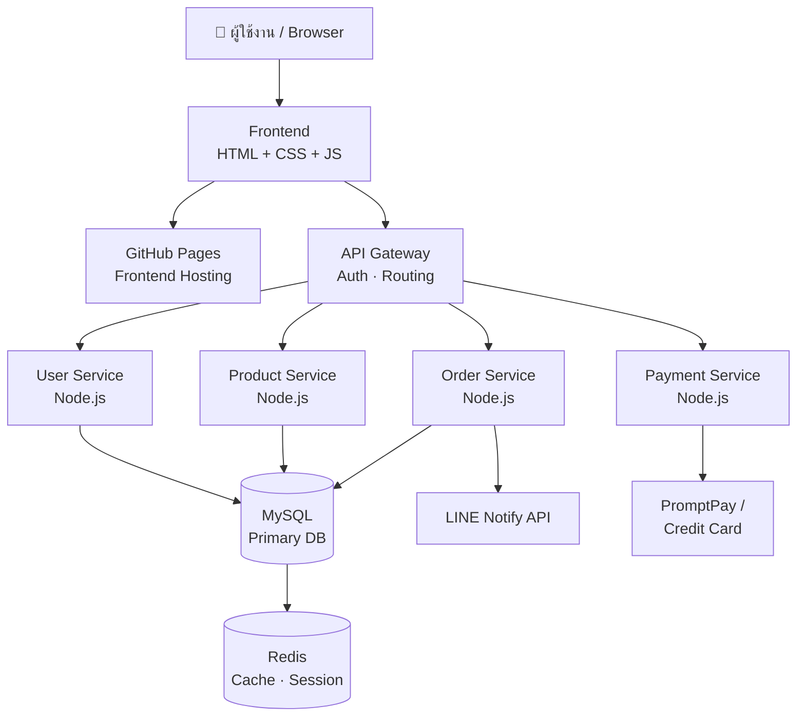

# 🌿 SkincareShop — ร้านสกินแคร์ออนไลน์

> ระบบร้านค้าออนไลน์สำหรับผลิตภัณฑ์ดูแลผิว ครอบคลุมตั้งแต่ Cleanser, Serum, Moisturizer ไปจนถึง Sunscreen  
> พัฒนาด้วย HTML / CSS / JavaScript และจัดการซอร์สโค้ดผ่าน GitHub

---

## 📋 รายละเอียดโครงการ

| รายการ | ข้อมูล |
|---|---|
| วิชา | CSI204 Digital Platform for Software Development |
| Workshop | #1 — Project Documentation with GitHub |
| ผู้พัฒนา | วิชญาดา กิตตินัฏพงศ์ รหัส 67154712 กลุ่ม T001 |
| GitHub Repository | https://github.com/bedyner/SkincareShop |
| GitHub Pages | https://bedyner.github.io/SkincareShop/ |
| Documentation (Docs) | https://bedyner.github.io/SkincareShop/markdown.html |

---

## 🎯 วัตถุประสงค์ของระบบ

SkincareShop เป็นเว็บไซต์ E-Commerce สำหรับจำหน่ายผลิตภัณฑ์สกินแคร์ออนไลน์ คล้ายกับ Watsons หรือ Boots โดยมีฟีเจอร์หลักดังนี้

- 🛍️ แสดงรายการสินค้าพร้อมรายละเอียดและราคา
- 🔍 ค้นหาและกรองสินค้าตามประเภท (Cleanser / Serum / Moisturizer / Sunscreen)
- 🛒 ระบบตะกร้าสินค้า (Shopping Cart)
- 👤 ระบบสมัครสมาชิก / Login
- 💳 ระบบชำระเงิน (PromptPay / บัตรเครดิต)
- 📦 ติดตามสถานะคำสั่งซื้อ

---

## 🏗️ System Architecture



---

## 📐 Analysis & Design

### Use Case หลัก

| Actor | Use Case |
|---|---|
| ลูกค้า | ค้นหาสินค้า, เพิ่มสินค้าลงตะกร้า, ชำระเงิน, ติดตามคำสั่งซื้อ |
| แอดมิน | จัดการสินค้า, ดูรายงานยอดขาย, จัดการคำสั่งซื้อ |

### Wireframe / UI Design

หน้าแรก (index.html) ออกแบบตามโครงสร้าง Component-Based ดังนี้

```
┌─────────────────────────────────────────────┐
│  NAV: Logo | Shop · About · Blog | 🔍 🛒    │
├─────────────────────┬───────────────────────┤
│                     │                       │
│   HERO TEXT         │   HERO IMAGE          │
│   Skincare for      │   (product visual)    │
│   every ritual      │                       │
│   [Shop Now] [View] │                       │
│                     │                       │
├─────────────────────┴───────────────────────┤
│  ── MARQUEE: Dermatologist Tested · ... ──  │
├─────────────────────────────────────────────┤
│  PRODUCTS GRID (4 cols)                     │
│  [Filter: All | Serums | Moisturizers | ...]│
│  ┌────┐ ┌────┐ ┌────┐ ┌────┐              │
│  │    │ │    │ │    │ │    │              │
│  └────┘ └────┘ └────┘ └────┘              │
├─────────────────────────────────────────────┤
│  SYSTEM ARCHITECTURE (CSI204 section)       │
├─────────────────────────────────────────────┤
│  WORKSHOP CHECKLIST                         │
└─────────────────────────────────────────────┘
```

### โครงสร้างหน้าเว็บไซต์

```
SkincareShop/
├── index.html            ← หน้าแรก: Hero + แบรนด์ + สินค้า + Promise + Contact (self-contained)
├── markdown.html         ← หน้า Docs (เรนเดอร์ Markdown ด้วย marked.js)
├── images/
│   └── products/         ← รูปสินค้า (วางไฟล์ .jpg/.png ตามชื่อในคู่มือ)
└── README.md
```

### ประเภทสินค้า (Product Categories)

| หมวดหมู่ | ตัวอย่างสินค้า |
|---|---|
| Cleanser | Foam Cleanser, Micellar Water, Oil Cleanser |
| Serum | Vitamin C Serum, Niacinamide Serum, Hyaluronic Acid |
| Moisturizer | Day Cream, Night Cream, Eye Cream |
| Sunscreen | SPF 30, SPF 50, SPF 50+ PA++++ |
| Mask | Sheet Mask, Clay Mask, Sleeping Mask |

### Software Architecture (3 Layers)

| Layer | เทคโนโลยี | หน้าที่ |
|---|---|---|
| **Frontend** | HTML5, CSS3, JavaScript (Vanilla) | แสดงผล UI, ตะกร้าสินค้า, ชำระเงิน |
| **Backend** | Node.js + Express.js | Business Logic, REST API, Auth |
| **Database** | MySQL + Redis | จัดเก็บข้อมูล, Cache, Session |

---

## 🛠️ เทคโนโลยีที่ใช้

| ส่วน | เทคโนโลยี |
|---|---|
| Frontend | HTML5, CSS3, JavaScript (Vanilla) |
| Backend | Node.js + Express.js |
| Database | MySQL + Redis |
| Version Control | Git + GitHub |
| GUI Git Client | Sourcetree |
| Deployment | GitHub Pages (Frontend) |
| Payment | PromptPay, Credit Card |

---

## ✅ Workshop #1 Checklist

- [x] สร้าง GitHub Repository ถูกต้อง — https://github.com/bedyner/SkincareShop
- [x] ใช้ Sourcetree และมี Commit History (ดู screenshot ด้านล่าง)
- [x] จัดทำ README.md ด้วย Markdown (ไฟล์นี้)
- [x] จัดทำเอกสาร Analysis & Design (Use Case, Wireframe, Architecture ด้านบน)
- [x] จัดทำภาพ System Architecture ด้วย Mermaid Diagram (ด้านบน)
- [x] GitHub Pages เผยแพร่ได้จริง — https://bedyner.github.io/SkincareShop/

---

## 📸 หลักฐานการทำงาน

### Sourcetree — Commit History

> ภาพ Screenshot จาก Sourcetree แสดง Commit History ของโปรเจกต์

_(แนบ screenshot Sourcetree ที่นี่ เช่น ``)_

### Mermaid Diagram Render

> ภาพ Mermaid Diagram ที่ render แล้วบน GitHub

_(Mermaid จะ render อัตโนมัติเมื่อ push ขึ้น GitHub — ดูใน section System Architecture ด้านบน)_

---

## 🚀 วิธีติดตั้งและรันโปรเจกต์

```bash
# 1. Clone Repository
git clone https://github.com/bedyner/SkincareShop.git

# 2. เข้าไปในโฟลเดอร์
cd SkincareShop

# 3. เปิดด้วย Live Server (VS Code Extension)
# หรือเปิดไฟล์ index.html ใน Browser ได้เลย
```

### วิธี Enable GitHub Pages

1. ไปที่ Repository → **Settings** → **Pages**
2. Source: เลือก **Deploy from a branch**
3. Branch: เลือก **main** / root
4. กด **Save** — รอสักครู่ แล้ว URL จะปรากฏ

---

## 📝 Commit History

| Commit | รายละเอียด |
|---|---|
| `Initial commit` | เริ่มต้นโปรเจกต์ — โครงสร้างไฟล์, index.html, pages, css, js, README |
| `docs: rewrite markdown.html as documentation page` | ทำหน้า Docs เรนเดอร์ Markdown ด้วย marked.js |
| `feat: connect all pages with shared nav & footer` | เชื่อมทุกหน้าเข้าด้วยกัน — nav/footer มาตรฐาน, ลิงก์ครบ |
| `fix: wire up cart logic via js/main.js` | ต่อระบบตะกร้าให้ทำงานจริงข้ามหน้า |
| `docs: update README structure & checklist` | อัปเดตเอกสาร README ให้ตรงกับโครงสร้างจริง |

---

*CSI204 — Digital Platform for Software Development | SPU*