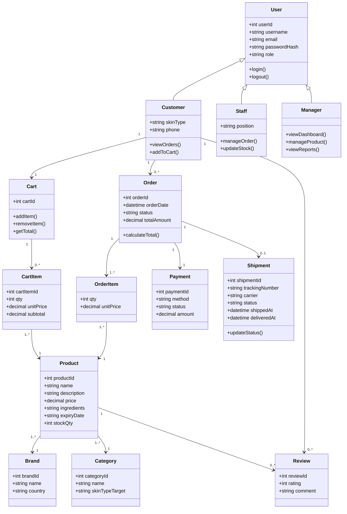
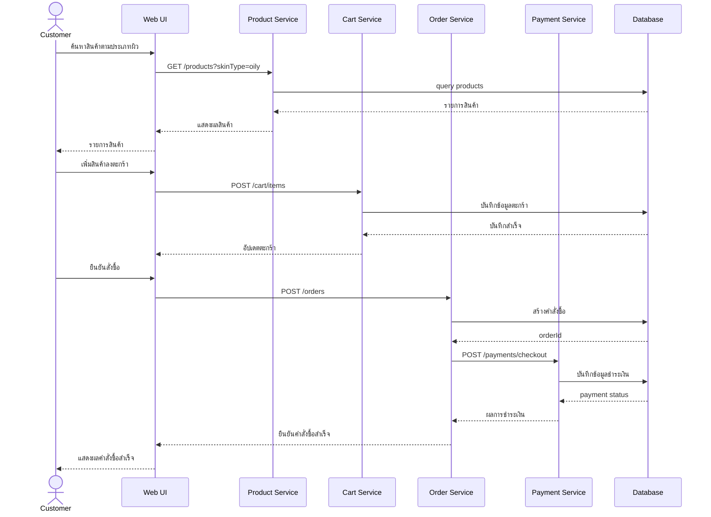
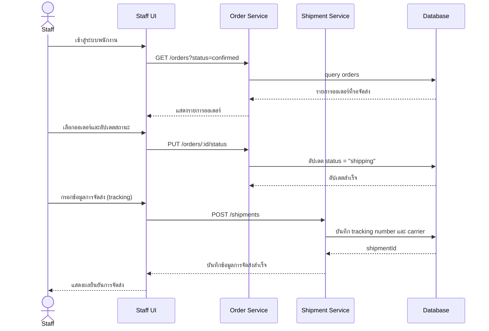
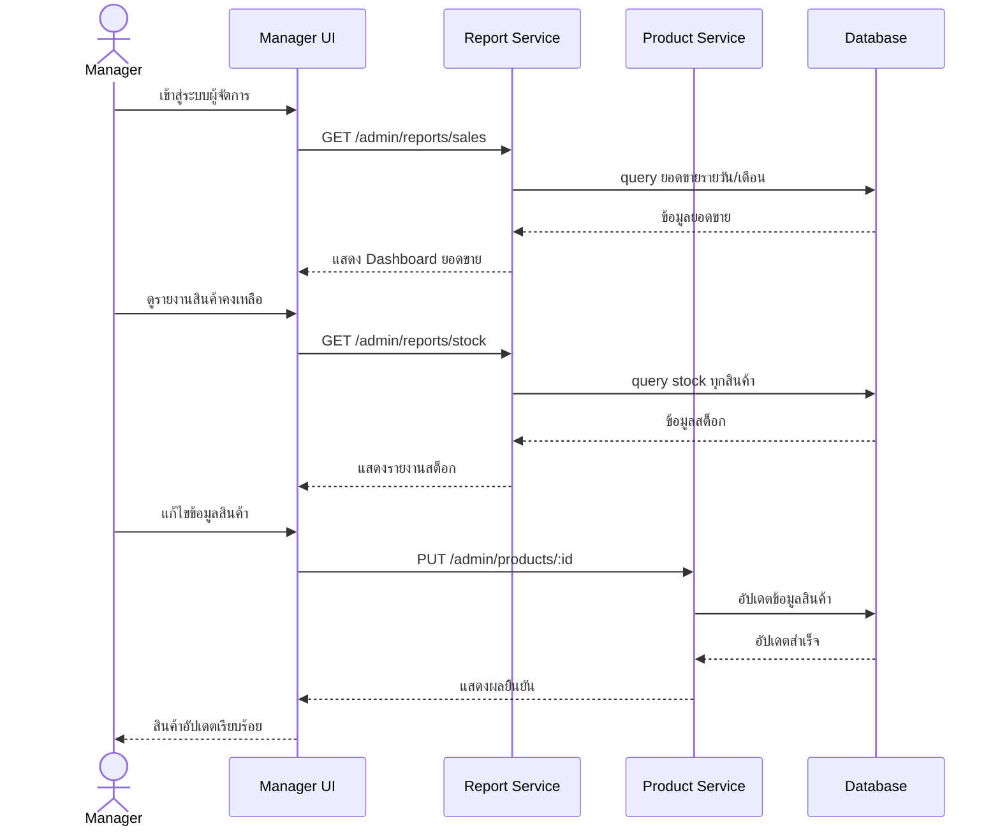
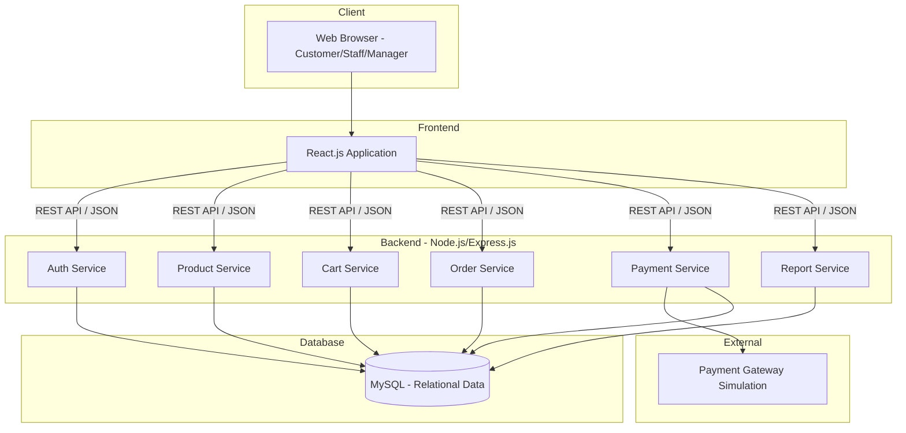
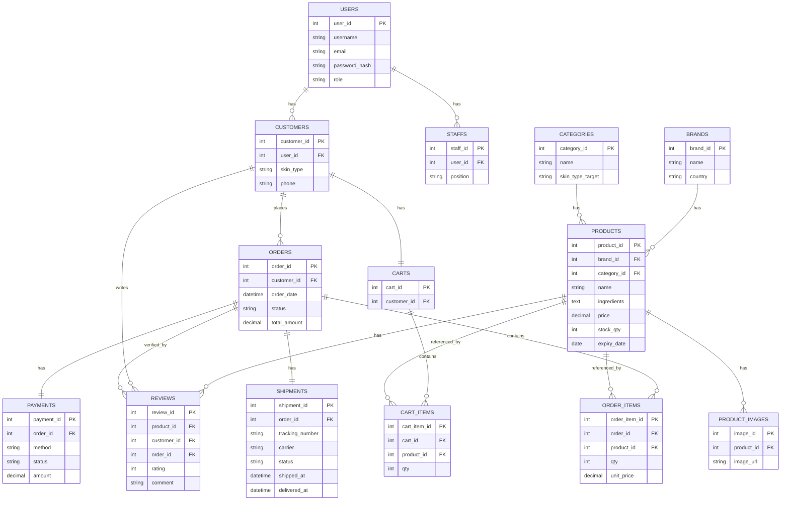
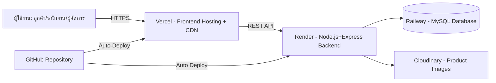

# GLOWTIME — ระบบร้านจำหน่ายสกินแคร์ออนไลน์

**ชื่อโครงงาน (ภาษาไทย):** ระบบร้านจำหน่ายเครื่องสำอางและผลิตภัณฑ์ดูแลผิวออนไลน์ "GLOWTIME"
**ชื่อโครงงาน (ภาษาอังกฤษ):** GLOWTIME — Skincare E-Commerce Platform
**Domain:** e-Commerce
**รายวิชา:** CSI204 ดิจิทัลแพลตฟอร์มสำหรับพัฒนาซอฟต์แวร์
**อ้างอิงข้อกำหนด:** ตามแบบฟอร์มขออนุมัติโครงงานกลุ่ม (หน้า 18) และข้อกำหนดหัวข้อโครงงานกลุ่ม / ขอบเขตขั้นต่ำของระบบ (หน้า 17)

---

## 1. ข้อมูลกลุ่ม (Group Information)

**ชื่อกลุ่ม:** GLOWTIME

**ชื่อกลุ่ม:** ......................................


**จำนวนสมาชิก:** 5 คน

| ลำดับ | รหัสนักศึกษา | ชื่อ-สกุล | ตำแหน่งในกลุ่ม |
|---|---|---|---|
| 1 | 67154712 | วิชญาดา กิตตินัฏพงศ์ | Frontend Developer (Customer) |
| 2 | 67163153 | ศิริเทพ ขวัญเนตร | Backend Developer (Customer) |
| 3 | 67170501 | จิรดา จารุจิตร | Frontend Developer (Admin) |
| 4 | 67171599 | ภัทรพล ไหมร้อน | Backend Developer (Admin) |
| 5 | 67119235 | กนกพร กันเพชร | Database Developer |

---

## 2. หลักการและเหตุผล (Rationale)

ตลาดผลิตภัณฑ์ดูแลผิว (Skincare) ในประเทศไทยเติบโตต่อเนื่อง ผู้บริโภคมีพฤติกรรมค้นหาข้อมูลและสั่งซื้อสินค้าผ่านช่องทางออนไลน์มากขึ้น โดยเฉพาะสินค้าที่ต้องการข้อมูลประกอบการตัดสินใจ เช่น ส่วนผสม (Ingredients), ประเภทผิวที่เหมาะสม และรีวิวจากผู้ใช้จริง ระบบ GLOWTIME จึงถูกพัฒนาขึ้นเพื่อเป็นแพลตฟอร์มร้านค้าออนไลน์เฉพาะทางด้านสกินแคร์ ที่ช่วยให้ลูกค้าค้นหาสินค้าที่เหมาะกับสภาพผิวของตนเองได้ง่าย พนักงานจัดการคำสั่งซื้อและสต็อกได้สะดวก และผู้จัดการสามารถวิเคราะห์ยอดขายเพื่อวางแผนธุรกิจได้อย่างมีประสิทธิภาพ

## 3. วัตถุประสงค์ของโครงงาน (Objectives)

1. เพื่อออกแบบและพัฒนา Web Application สำหรับซื้อ-ขายผลิตภัณฑ์สกินแคร์ออนไลน์ตามแนวทาง SDLC
2. เพื่อให้ลูกค้าสามารถค้นหาผลิตภัณฑ์ตามประเภทผิว แบรนด์ และส่วนผสมได้อย่างสะดวกและรวดเร็ว
3. เพื่อให้ผู้ดูแลระบบสามารถบริหารจัดการสินค้า คำสั่งซื้อ และดูรายงานสรุปยอดขายผ่านแดชบอร์ดได้

## 5. ขอบเขตของระบบ (System Scope)

**ผู้ใช้งาน (Actors)**
- ลูกค้า (Customer)
- พนักงาน (Staff)
- ผู้จัดการ (Manager)

**ความสามารถหลักของระบบ (Main Functions)** — อ้างอิงขอบเขตขั้นต่ำของระบบ e-Commerce (หน้า 17)
1. การจัดการสมาชิก (Register / Login)
2. การจัดการข้อมูลสินค้า (เพิ่ม/แก้ไข/ลบสินค้า, หมวดหมู่, ประเภทผิว)
3. การค้นหาและแสดงรายละเอียดสินค้า (ค้นหาตามแบรนด์ ประเภทผิว ราคา ส่วนผสม)
4. ระบบตะกร้าสินค้า (Shopping Cart)
5. ระบบสั่งซื้อสินค้า (Order Management)
6. ระบบชำระเงิน (Simulation/Mockup)
7. ระบบติดตามสถานะคำสั่งซื้อ
8. ระบบจัดการสินค้าและคำสั่งซื้อสำหรับผู้ดูแลระบบ/พนักงาน
9. รายงานหรือ Dashboard สรุปยอดขาย สินค้าคงเหลือ และผลประกอบการ

---

## 6. Persona Design

### ลูกค้า (Customer)
- **ชื่อ:** คุณนภัสสร ใส่ใจผิว
- **อายุ:** 26 ปี
- **อาชีพ:** พนักงานออฟฟิศ
- **รายได้:** 25,000 บาท/เดือน
- **ความสนใจ:** สกินแคร์เกาหลี/ญี่ปุ่น เซรั่มบำรุงผิว ผลิตภัณฑ์ออร์แกนิก
- **เป้าหมาย:**
  - ต้องการหาผลิตภัณฑ์ที่เหมาะกับสภาพผิวแพ้ง่ายของตนเอง
  - ต้องการเปรียบเทียบส่วนผสมและรีวิวก่อนตัดสินใจซื้อ
  - ต้องการความสะดวกรวดเร็วในการสั่งซื้อและชำระเงิน
- **ความต้องการ:** ระบบค้นหาสินค้าตามประเภทผิวและส่วนผสม ข้อมูลสินค้าและรีวิวที่ครบถ้วน ระบบตะกร้าและชำระเงินที่ปลอดภัย
- **ความท้าทาย:** มีตัวเลือกสินค้ามากจนตัดสินใจไม่ถูก กลัวได้สินค้าปลอมหรือหมดอายุ ไม่มั่นใจว่าผลิตภัณฑ์เหมาะกับสภาพผิวตนเองหรือไม่

### พนักงาน (Staff)
- **ชื่อ:** คุณกานต์ดูแลร้าน
- **อายุ:** 24 ปี
- **อาชีพ:** พนักงานขาย/คลังสินค้า
- **รายได้:** 18,000 บาท/เดือน + ค่าคอมมิชชั่น
- **ความสนใจ:** เทคนิคการขาย ความรู้เรื่องผลิตภัณฑ์ผิว การบริการลูกค้า
- **เป้าหมาย:**
  - ต้องการจัดการคำสั่งซื้อและสต็อกสินค้าได้อย่างถูกต้องรวดเร็ว
  - ต้องการให้คำแนะนำลูกค้าได้อย่างมั่นใจ
- **ความต้องการ:** ระบบจัดการออเดอร์ที่ใช้งานง่าย ระบบแจ้งเตือนสต็อกใกล้หมด ข้อมูลสินค้าที่เป็นปัจจุบัน
- **ความท้าทาย:** ต้องรับมือคำถามลูกค้าหลากหลาย ต้องตรวจสอบวันหมดอายุของสินค้าอย่างละเอียด

### ผู้จัดการ (Manager)
- **ชื่อ:** คุณวรากร บริหารร้าน
- **อายุ:** 38 ปี
- **อาชีพ:** ผู้จัดการร้านค้าออนไลน์
- **รายได้:** 55,000 บาท/เดือน
- **ความสนใจ:** การตลาดดิจิทัล การวิเคราะห์ข้อมูลลูกค้า การบริหารสต็อก
- **เป้าหมาย:**
  - ต้องการเพิ่มยอดขายและผลกำไรของร้าน
  - ต้องการวิเคราะห์แนวโน้มสินค้าขายดีเพื่อวางแผนสต็อกและโปรโมชั่น
- **ความต้องการ:** แดชบอร์ดสรุปยอดขาย/สินค้าคงเหลือ/สินค้าขายดี ระบบรายงานรายวัน-รายเดือน
- **ความท้าทาย:** ต้องแข่งขันกับร้านสกินแคร์ออนไลน์อื่นจำนวนมาก ต้องติดตามเทรนด์ผลิตภัณฑ์ที่เปลี่ยนเร็ว

---

## 4. แนวทางการพัฒนาโครงงานตามแนวทาง SDLC

โครงงาน GLOWTIME พัฒนาตามแนวทาง **System Development Life Cycle (SDLC)** ครบ 7 เฟส ดังนี้

| เฟส | ชื่อขั้นตอน | รายละเอียดโดยย่อ |
|---|---|---|
| 1 | **Planning (การวางแผน)** | กำหนดขอบเขตโครงงาน วิเคราะห์ความต้องการเบื้องต้นของผู้ใช้ทั้ง 3 กลุ่ม (ลูกค้า/พนักงาน/ผู้จัดการ) ประเมินทรัพยากรและระยะเวลาพัฒนา 4 สัปดาห์ |
| 2 | **Analysis (การวิเคราะห์)** | วิเคราะห์ความต้องการระบบอย่างละเอียดผ่าน Persona Design จัดทำ Use Case Diagram, Class Diagram และ Sequence Diagram เพื่อกำหนดขอบเขตฟังก์ชันการทำงานทั้งหมด |
| 3 | **Design (การออกแบบ)** | ออกแบบฐานข้อมูล (ER Diagram, Data Schema) ออกแบบ System Architecture แบบ REST API และออกแบบ UI/UX ผ่าน Wireframe ด้วย Figma ตาม Persona ที่กำหนด |
| 4 | **Development (การพัฒนา)** | พัฒนา Frontend ด้วย React.js พัฒนา Backend ด้วย Node.js/Express.js เชื่อมต่อฐานข้อมูล MySQL และพัฒนา REST API ให้ครบตามที่ออกแบบไว้ |
| 5 | **Testing (การทดสอบ)** | ทดสอบการทำงานของระบบด้วยวิธี UAT (User Acceptance Testing) แบบ Manual Testing ครอบคลุมทุกฟังก์ชันของทั้ง 3 role ตาม Test Plan 18 เคส |
| 6 | **Deployment (การติดตั้ง)** | นำระบบขึ้น Cloud Platform ฟรี (Vercel สำหรับ Frontend และ Render สำหรับ Backend) โดยเชื่อมต่อกับ GitHub เพื่อทำ CI/CD แบบ Auto Deploy อัตโนมัติเมื่อ Push โค้ด และทดสอบการใช้งานจริงก่อนเปิดให้บริการ |
| 7 | **Maintenance (การบำรุงรักษา)** | ติดตามประสิทธิภาพระบบ แก้ไขข้อผิดพลาดที่พบหลังเปิดใช้งาน รับ Feedback จากผู้ใช้เพื่อปรับปรุง UI/UX และวางแผนพัฒนาฟีเจอร์เพิ่มเติมในอนาคต |

---

## 7. Use Case Diagram

```mermaid
graph TB
    Customer((ลูกค้า))
    Staff((พนักงาน))
    Manager((ผู้จัดการ))

    subgraph customerFuncs["ฟังก์ชันสำหรับลูกค้า"]
        UC1[สมัครสมาชิก/เข้าสู่ระบบ]
        UC2[ค้นหาสินค้าตามประเภทผิว/แบรนด์]
        UC3[ดูรายละเอียดสินค้า]
        UC4[จัดการตะกร้าสินค้า]
        UC5[สั่งซื้อสินค้า]
        UC6[ชำระเงิน]
        UC7[ติดตามสถานะคำสั่งซื้อ]
        UC8[เขียนรีวิวสินค้า]
    end

    subgraph staffFuncs["ฟังก์ชันสำหรับพนักงาน"]
        UC9[เข้าสู่ระบบพนักงาน]
        UC10[จัดการคำสั่งซื้อ]
        UC11[จัดการสต็อกสินค้า]
        UC12[อัปเดตสถานะการจัดส่ง]
    end

    subgraph managerFuncs["ฟังก์ชันสำหรับผู้จัดการ"]
        UC13[เข้าสู่ระบบผู้จัดการ]
        UC14[จัดการข้อมูลสินค้า]
        UC15[ดูรายงานสรุปยอดขาย]
        UC16[ดูรายงานสินค้าคงเหลือ]
        UC17[จัดการบัญชีผู้ใช้]
    end

    Customer --> UC1
    Customer --> UC2
    Customer --> UC3
    Customer --> UC4
    Customer --> UC5
    Customer --> UC6
    Customer --> UC7
    Customer --> UC8

    Staff --> UC9
    Staff --> UC10
    Staff --> UC11
    Staff --> UC12

    Manager --> UC13
    Manager --> UC14
    Manager --> UC15
    Manager --> UC16
    Manager --> UC17

    UC5 -. "include" .-> UC6
    UC2 -. "include" .-> UC3
```



---

## 8. Class Diagram



---

## 9. Sequence Diagram (กระบวนการสั่งซื้อสินค้าของลูกค้า)



---

## 9.1 Sequence Diagram (พนักงานจัดการคำสั่งซื้อและการจัดส่ง)



---

## 9.2 Sequence Diagram (ผู้จัดการดูรายงานและจัดการสินค้า)



---

## 10. Wireframe (โครงร่างหน้าจอหลัก)

| หน้าจอ | องค์ประกอบหลัก |
|---|---|
| หน้าแรก (Home) | แบนเนอร์โปรโมชั่น สินค้าขายดี สินค้ามาใหม่ หมวดหมู่ตามประเภทผิว |
| หน้าค้นหา (Search/Filter) | ตัวกรอง: แบรนด์ ประเภทผิว ช่วงราคา ส่วนผสม |
| หน้ารายละเอียดสินค้า (Product Detail) | รูปภาพ ราคา ส่วนผสม วิธีใช้ รีวิว สินค้าที่เกี่ยวข้อง |
| หน้าตะกร้าสินค้า (Cart) | รายการสินค้า จำนวน ราคารวม โค้ดส่วนลด |
| หน้าชำระเงิน (Checkout) | ที่อยู่จัดส่ง วิธีชำระเงิน สรุปคำสั่งซื้อ |
| หน้าพนักงาน (Staff Dashboard) | รายการคำสั่งซื้อใหม่ จัดการสต็อก อัปเดตสถานะจัดส่ง |
| หน้าผู้จัดการ (Manager Dashboard) | กราฟยอดขาย รายงานสินค้าคงเหลือ จัดการสินค้า |

> หมายเหตุ: แนะนำให้ออกแบบ Wireframe ฉบับเต็มด้วย Figma ตาม Persona ที่กำหนดไว้ในข้อ 4 ก่อนเริ่มพัฒนา Frontend จริง

---

## 11. System Architecture



---

## 12. Database Design (ER Diagram)



---

## 13. Data Schema (JSON)

> Schema แต่ละ object สอดคล้องกับ Class Diagram (ข้อ 6) และ ER Diagram (ข้อ 10)

### user (ข้อมูลผู้ใช้และ role)
```json
{
  "userId": 305,
  "username": "naphatsorn_k",
  "email": "naphatsorn@email.com",
  "passwordHash": "$2b$10$examplehashvalue",
  "role": "customer",
  "createdAt": "2026-01-15T08:00:00+07:00",
  "profile": {
    "skinType": "sensitive",
    "phone": "081-234-5678"
  }
}
```
> `role` มี 3 ค่าที่เป็นไปได้: `"customer"` | `"staff"` | `"manager"`
> ถ้า role เป็น `"staff"` จะมี field เพิ่มเติม: `"position": "warehouse"`
> ถ้า role เป็น `"manager"` จะไม่มี profile.skinType

---

### product (สินค้า)
```json
{
  "productId": 1001,
  "name": "Hyaluronic Acid Serum 30ml",
  "brand": "GlowLab",
  "category": "Serum",
  "skinTypeTarget": ["dry", "sensitive"],
  "ingredients": ["Hyaluronic Acid", "Panthenol", "Niacinamide"],
  "price": 590.00,
  "stockQty": 120,
  "expiryDate": "2027-05-01",
  "images": ["https://cdn.glowdermhub.com/p/1001-1.jpg"],
  "averageRating": 4.6,
  "reviewCount": 38
}
```

---

### cart (ตะกร้าสินค้า)
```json
{
  "cartId": "CART-305",
  "customerId": 305,
  "items": [
    {
      "cartItemId": 1,
      "productId": 1001,
      "productName": "Hyaluronic Acid Serum 30ml",
      "unitPrice": 590.00,
      "qty": 2,
      "subtotal": 1180.00
    }
  ],
  "totalAmount": 1180.00,
  "updatedAt": "2026-06-30T10:10:00+07:00"
}
```

---

### order (คำสั่งซื้อ)
```json
{
  "orderId": "ORD-20260630-0001",
  "customerId": 305,
  "status": "pending_payment",
  "items": [
    {
      "orderItemId": 1,
      "productId": 1001,
      "productName": "Hyaluronic Acid Serum 30ml",
      "qty": 2,
      "unitPrice": 590.00,
      "subtotal": 1180.00
    }
  ],
  "totalAmount": 1180.00,
  "shippingAddress": {
    "recipient": "นภัสสร ใส่ใจผิว",
    "address": "123/45 ถ.สุขุมวิท",
    "province": "กรุงเทพมหานคร",
    "postalCode": "10110"
  },
  "createdAt": "2026-06-30T10:15:00+07:00"
}
```
> `status` มี 4 ค่า: `"pending_payment"` → `"confirmed"` → `"shipping"` → `"delivered"`

---

### payment (การชำระเงิน)
```json
{
  "paymentId": "PAY-20260630-0001",
  "orderId": "ORD-20260630-0001",
  "method": "credit_card",
  "status": "success",
  "amount": 1180.00,
  "paidAt": "2026-06-30T10:16:00+07:00"
}
```
> `method` มี 3 ค่า: `"credit_card"` | `"qr_code"` | `"bank_transfer"`

---

### review (รีวิวสินค้า)
```json
{
  "reviewId": 88,
  "productId": 1001,
  "customerId": 305,
  "orderId": "ORD-20260630-0001",
  "rating": 5,
  "comment": "ผิวชุ่มชื้นมากขึ้นหลังใช้ 1 สัปดาห์ เหมาะกับผิวแพ้ง่ายมาก",
  "createdAt": "2026-07-07T14:30:00+07:00"
}
```

---

### shipment (การจัดส่ง)
```json
{
  "shipmentId": 501,
  "orderId": "ORD-20260630-0001",
  "trackingNumber": "TH123456789EX",
  "carrier": "Kerry Express",
  "status": "in_transit",
  "shippedAt": "2026-07-01T09:00:00+07:00",
  "deliveredAt": null
}
```
> `status` มี 3 ค่า: `"pending"` → `"in_transit"` → `"delivered"`
> `carrier` ตัวอย่าง: `"Kerry Express"` | `"Flash Express"` | `"Thailand Post"`

---

## 14. API Design (REST API)

| Method | Endpoint | คำอธิบาย |
|---|---|---|
| POST | `/api/auth/register` | สมัครสมาชิก |
| POST | `/api/auth/login` | เข้าสู่ระบบ |
| GET | `/api/products` | ดึงรายการสินค้า (รองรับ filter: skinType, brand, price) |
| GET | `/api/products/:id` | ดึงรายละเอียดสินค้า |
| POST | `/api/cart/items` | เพิ่มสินค้าลงตะกร้า |
| PUT | `/api/cart/items/:id` | แก้ไขจำนวนสินค้าในตะกร้า |
| DELETE | `/api/cart/items/:id` | ลบสินค้าออกจากตะกร้า |
| POST | `/api/orders` | สร้างคำสั่งซื้อ |
| GET | `/api/orders/:id` | ตรวจสอบสถานะคำสั่งซื้อ |
| POST | `/api/payments/checkout` | ดำเนินการชำระเงิน (Simulation) |
| GET | `/api/cart` | ดึงข้อมูลตะกร้าสินค้าปัจจุบัน |
| POST | `/api/reviews` | เขียนรีวิวสินค้า (Customer) |
| PUT | `/api/orders/:id/status` | อัปเดตสถานะคำสั่งซื้อ (Staff) |
| GET | `/api/admin/reports/sales` | รายงานยอดขาย (Manager) |
| GET | `/api/admin/reports/stock` | รายงานสินค้าคงเหลือ (Manager) |
| PUT | `/api/admin/products/:id` | แก้ไขข้อมูลสินค้า (Staff/Manager) |

---

## 15. Test Plan (UAT — Manual Testing)

> ตามขอบเขตการทดสอบของวิชา CSI204: ใช้วิธี **User Acceptance Testing (UAT) แบบ Manual Testing** โดยรันระบบจริงแล้วทดสอบการทำงานของแต่ละฟังก์ชันตามผลลัพธ์ที่คาดหวัง ไม่มีการวัดผลด้วยเครื่องมือทดสอบอัตโนมัติหรือจัดทำรายงานผลทดสอบอย่างเป็นทางการ

| รหัส | ฟังก์ชันที่ทดสอบ | ขั้นตอนการทดสอบ | ผลลัพธ์ที่คาดหวัง |
|---|---|---|---|
| TC-01 | สมัครสมาชิก | กรอกอีเมล/รหัสผ่าน แล้วกดสมัคร | ระบบสร้างบัญชีใหม่และพาเข้าสู่หน้า Login สำเร็จ |
| TC-02 | เข้าสู่ระบบ | กรอกอีเมล/รหัสผ่านที่ถูกต้อง | เข้าสู่ระบบสำเร็จ พาไปหน้าแรก |
| TC-03 | ค้นหาสินค้าตามประเภทผิว | เลือกตัวกรอง "ผิวแห้ง" | แสดงเฉพาะสินค้าที่ระบุว่าเหมาะกับผิวแห้ง |
| TC-04 | เพิ่มสินค้าลงตะกร้า | กดปุ่ม "เพิ่มลงตะกร้า" จากหน้ารายละเอียดสินค้า | สินค้าปรากฏในตะกร้าพร้อมจำนวนถูกต้อง |
| TC-05 | คำนวณราคารวมในตะกร้า | เปลี่ยนจำนวนสินค้าในตะกร้า | ราคารวมอัปเดตถูกต้องตามจำนวน |
| TC-06 | สั่งซื้อสินค้า | กรอกที่อยู่จัดส่งและยืนยันคำสั่งซื้อ | ระบบสร้างคำสั่งซื้อใหม่และแสดงเลขที่ออเดอร์ |
| TC-07 | ชำระเงิน (Simulation) | เลือกวิธีชำระเงินและยืนยัน | สถานะคำสั่งซื้อเปลี่ยนเป็น "ชำระเงินสำเร็จ" |
| TC-08 | ติดตามสถานะคำสั่งซื้อ | เข้าหน้าประวัติคำสั่งซื้อ | แสดงสถานะปัจจุบันของคำสั่งซื้อถูกต้อง |
| TC-09 | เขียนรีวิวสินค้า | หลังได้รับสินค้า กดเขียนรีวิวพร้อมให้คะแนน | รีวิวปรากฏในหน้าสินค้า คะแนนเฉลี่ยอัปเดต |
| TC-10 | เข้าสู่ระบบพนักงาน | Login ด้วย account ที่มี role = staff | เข้าสู่หน้า Staff Dashboard ได้ ไม่สามารถเข้าหน้า Customer ได้ |
| TC-11 | พนักงานดูรายการออเดอร์ใหม่ | เข้าหน้า Order Management | แสดงออเดอร์ที่มีสถานะ confirmed พร้อมข้อมูลครบถ้วน |
| TC-12 | พนักงานอัปเดตสถานะออเดอร์ | เลือกออเดอร์ กดเปลี่ยนสถานะเป็น "shipping" | สถานะออเดอร์เปลี่ยน ลูกค้าเห็นสถานะใหม่ที่หน้าติดตามออเดอร์ |
| TC-13 | พนักงานบันทึกข้อมูลการจัดส่ง | กรอก tracking number และ carrier แล้วบันทึก | ระบบบันทึก shipment ได้ถูกต้อง |
| TC-14 | จัดการสต็อกสินค้า | พนักงานแก้ไขจำนวนสต็อกสินค้า | ระบบบันทึกจำนวนสต็อกใหม่ถูกต้อง |
| TC-15 | เข้าสู่ระบบผู้จัดการ | Login ด้วย account ที่มี role = manager | เข้าสู่หน้า Manager Dashboard ได้ ไม่สามารถเข้าหน้า Staff/Customer ได้ |
| TC-16 | ดูรายงานยอดขาย | เข้าหน้า Dashboard ผู้จัดการ | แสดงกราฟ/ตัวเลขยอดขายตรงกับข้อมูลคำสั่งซื้อจริง |
| TC-17 | ดูรายงานสินค้าคงเหลือ | กดดูรายงาน Stock Report | แสดงจำนวนสต็อกสินค้าทุกรายการถูกต้อง |
| TC-18 | ผู้จัดการแก้ไขข้อมูลสินค้า | แก้ไขราคาสินค้าและกดบันทึก | ราคาสินค้าอัปเดตในหน้าสินค้าทันที |

---

## 16. Deployment Architecture



**Workflow การ Deploy:**
1. Push โค้ดขึ้น GitHub Repository
2. Vercel และ Render ดึงโค้ดจาก GitHub อัตโนมัติ พร้อมรัน Build ในตัว (ไม่ต้องตั้ง GitHub Actions เพิ่มเติม)
3. Deploy Frontend ขึ้น Vercel (Free Tier) และ Backend ขึ้น Render (Free Tier) โดยไม่มีค่าใช้จ่าย
4. ตรวจสอบการทำงานผ่าน Manual UAT ก่อนเปิดใช้งานจริง

> **หมายเหตุ:** เลือกใช้ Vercel + Render + Railway เนื่องจากรองรับ Free Tier เหมาะกับโครงงานนักศึกษาที่ไม่มีค่าใช้จ่ายด้าน Cloud โดย Vercel ให้บริการ Hosting + CDN สำหรับ React.js โดยตรง, Render ใช้รัน Backend Node.js/Express แบบ Web Service ฟรี, Railway ใช้เป็น MySQL Database แบบ Free Tier และ Cloudinary ใช้จัดเก็บรูปภาพสินค้าแทน AWS S3

---

## 17. เครื่องมือและเทคโนโลยีที่ใช้ (สรุปสำหรับกรอกฟอร์ม)

| หมวด | เทคโนโลยี |
|---|---|
| Frontend | React.js |
| Backend | Node.js, Express.js |
| Database | MySQL |
| Design Tool | Figma, Mermaid (สำหรับ Diagram) |
| Version Control | Git, GitHub |
| Testing Approach | User Acceptance Testing (UAT) — Manual Testing |
| Deployment / Hosting | Vercel (Frontend), Render (Backend), Railway (MySQL Database), Cloudinary (Product Images) — ทั้งหมดใช้ Free Tier |


---

## 18. แผนการดำเนินงาน 4 สัปดาห์ (Work Plan)

| สัปดาห์ | กิจกรรม | รายละเอียดโดยย่อ |
|---|---|---|
| 1 | Analysis & Design | จัดทำ Persona, Use Case, Class Diagram, Sequence Diagram, ER Diagram |
| 2 | Frontend Development | พัฒนาหน้า Home, Search, Product Detail, Cart ด้วย React.js |
| 3 | Backend & Database Development | พัฒนา REST API ด้วย Node.js/Express และเชื่อมต่อ MySQL |
| 4 | Testing & Presentation | ทำ UAT แบบ Manual Testing ทุกฟังก์ชัน และเตรียมนำเสนอผลงาน |

---


---

## 18. แผนการดำเนินงาน 4 สัปดาห์ (Work Plan)

| สัปดาห์ | กิจกรรม | รายละเอียดโดยย่อ |
|---|---|---|
| 1 | Analysis & Design | จัดทำ Persona, Use Case, Class Diagram, Sequence Diagram, ER Diagram |
| 2 | Frontend Development | พัฒนาหน้า Home, Search, Product Detail, Cart ด้วย React.js |
| 3 | Backend & Database Development | พัฒนา REST API ด้วย Node.js/Express และเชื่อมต่อ MySQL |
| 4 | Testing & Presentation | ทำ UAT แบบ Manual Testing ทุกฟังก์ชัน และเตรียมนำเสนอผลงาน |

---

### หมายเหตุการนำไปใช้
เอกสารนี้จัดทำขึ้นเพื่อใช้เป็นข้อมูลอ้างอิงประกอบการกรอกแบบฟอร์มขออนุมัติโครงงานกลุ่ม (หน้า 18) ของวิชา CSI204 โดยเนื้อหาทุกหัวข้อสอดคล้องกับขอบเขตขั้นต่ำของระบบ e-Commerce และข้อกำหนดหัวข้อโครงงานกลุ่มตามเอกสารหน้า 17

